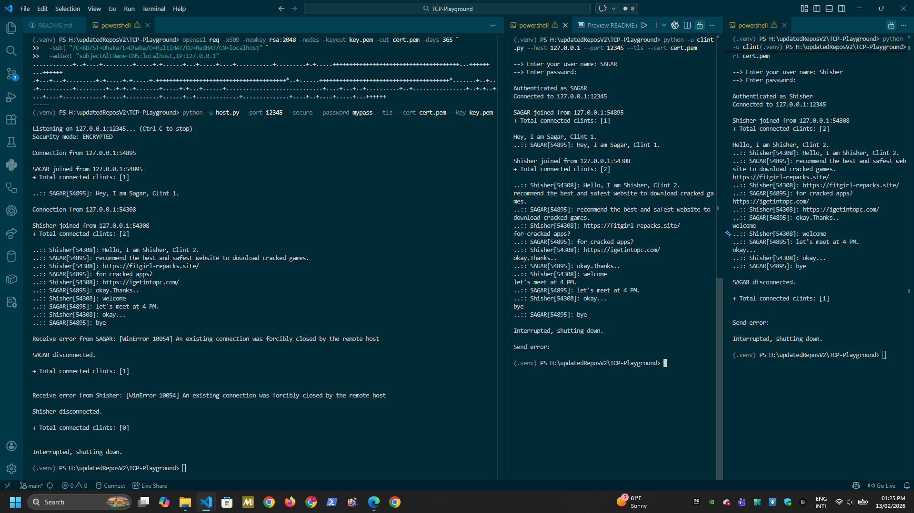

# Network Communication Scripts

---



---

Small, human-friendly toolkit to demonstrate simple TCP client/server communication using Python.

This repository contains two scripts:

- host.py — a minimal TCP listener (server)
- clint.py — a minimal TCP client that connects to host.py

Both scripts are intentionally small for learning and ad-hoc testing. They are implemented in pure Python and work on Windows, macOS, and Linux with Python 3.9+.

Note: the client file name is clint.py (intentionally kept as-is).

---

## Requirements

- Python 3.9 or newer
- No external runtime dependencies

---

## Quick Start — interactive mode

Open two terminals on the same machine (or on two machines on the same LAN).

1. Start the server (prompts for port):

```powershell
python -u host.py
```

2. Start the client (prompts for host/port):

```powershell
python -u clint.py
```

Once connected, anything you type in either terminal will be sent to the other side (line-buffered). Press Ctrl-C to stop.

---

## CLI usage (non-interactive)

Server:

```powershell
python -u "h:\GitHub Clone\Network_Communication_Scripts\host.py" --bind 0.0.0.0 --port 12345
```

Client:

```powershell
python -u "h:\GitHub Clone\Network_Communication_Scripts\clint.py" --host 127.0.0.1 --port 12345
```

Optional flags (both scripts):

- --timeout <seconds> (0 = blocking)
- --tls (enable TLS)
- --tls-insecure (disable TLS verification; local testing only)
- --cert / --key (server only, required for TLS)

---

## TLS (optional)

To encrypt traffic, pass --tls on both sides and provide a certificate and key to the server.

Example (generate a self-signed cert with OpenSSL):

```powershell
openssl req -x509 -newkey rsa:2048 -nodes -keyout key.pem -out cert.pem -days 365
```

Server:

```powershell
python -u "h:\GitHub Clone\Network_Communication_Scripts\host.py" --port 12345 --tls --cert cert.pem --key key.pem
```

Client (with verification disabled for self-signed certs):

```powershell
python -u "h:\GitHub Clone\Network_Communication_Scripts\clint.py" --host 127.0.0.1 --port 12345 --tls --tls-insecure
```

---

## Behavior and design notes

- Single connection at a time (intentionally simple)
- Messages are exchanged as text, line-buffered
- Input is validated: ports must be 1–65535, hosts must resolve
- The server binds to all interfaces by default (so it can accept LAN connections)

---

## Troubleshooting

- Connection refused: verify the server is running, the port is correct, and firewall rules allow inbound TCP.
- Wrong IP: run ipconfig (Windows) or ip addr (Linux/macOS) on the server machine and use that IP.
- Garbled text: binary data is not preserved; decoding uses error replacement.

---

## Tests and CI

Run tests locally:

```powershell
pip install -r requirements.txt
pytest -q
```

GitHub Actions workflow is defined in .github/workflows/python-ci.yml.

## Developer notes — `net_utils.py`

This project includes a compact, well‑tested helper module, `net_utils.py`, which both `host.py` and `clint.py` import.

Purpose

- Reduce duplication and keep CLI behavior consistent across the server and client.
- Provide small, easy-to-unit-test utilities for parsing, validating and prompting for network input.

What’s in the module (at-a-glance)

- `parse_port(value: str) -> Optional[int]` — safely parse user port input. Returns an int in 1–65535 or `None` on invalid input.
- `resolve_host(value: str) -> Optional[str]` — quick validation of an IP address or hostname; returns the original string when resolvable, otherwise `None`.
- `prompt_for_port(prompt: str) -> int` / `prompt_for_host(prompt: str) -> str` — interactive prompts that validate input and raise `ValueError` on invalid responses (used by the interactive CLI flows).
- `add_common_args(parser: argparse.ArgumentParser) -> None` — attaches the shared CLI flags used by both scripts: `--port`, `--timeout`, `--tls`, `--cert`, `--key`, and `--tls-insecure`.
- `validate_port_arg(value: Optional[int]) -> Optional[int]` / `validate_timeout(value: float) -> float` — argument validators used by entrypoints to normalize and check CLI-supplied values.

Why this design helps

- Consistency: both entrypoints present identical flags and validation behavior.
- Testability: logic that is easy to unit-test (see `tests/test_net_utils.py`) is separated from interactive and network code.
- Extensibility: adding new shared options (for example `--bind` validation or TLS context helpers) is a single change.

Quick examples

Importing validation helpers in the server:

```python
from net_utils import add_common_args, validate_port_arg

parser = argparse.ArgumentParser()
add_common_args(parser)
args = parser.parse_args()
port = validate_port_arg(args.port)
```

Interactive prompt usage in the client:

```python
from net_utils import prompt_for_host, prompt_for_port

host = prompt_for_host("Enter the IP address of the server: ")
port = prompt_for_port("Enter the port you want to connect to: ")
```

Testing

- Unit tests for parsing and validation live in `tests/test_net_utils.py`. Run them locally with:

```powershell
pip install -r requirements.txt
pytest -q
```

Recommended next steps (for maintainers)

- Add concise docstrings to each function in `net_utils.py` (helps IDEs and new contributors).
- Consider moving TLS context creation (client/server wrap functions) into `net_utils.py` if you want to centralize TLS behavior and testing.
- Add more validation utilities (e.g., `validate_bind_address`) if you expose `--bind` or other network flags.

Notes

- The functions intentionally return `None` or raise `ValueError` rather than exit the process — this keeps them safe to use in both scripts and in unit tests.
- Keep `net_utils.py` small: its value is in being lightweight and easy to test.

---

## Security reminder

These scripts are intended for learning and quick experiments only. They do not implement authentication or authorization. Use TLS if traffic must be protected and do not expose the server to untrusted networks.

---

## Contributing

Contributions welcome. Open an issue or a pull request with a clear description of the change and why it helps.
